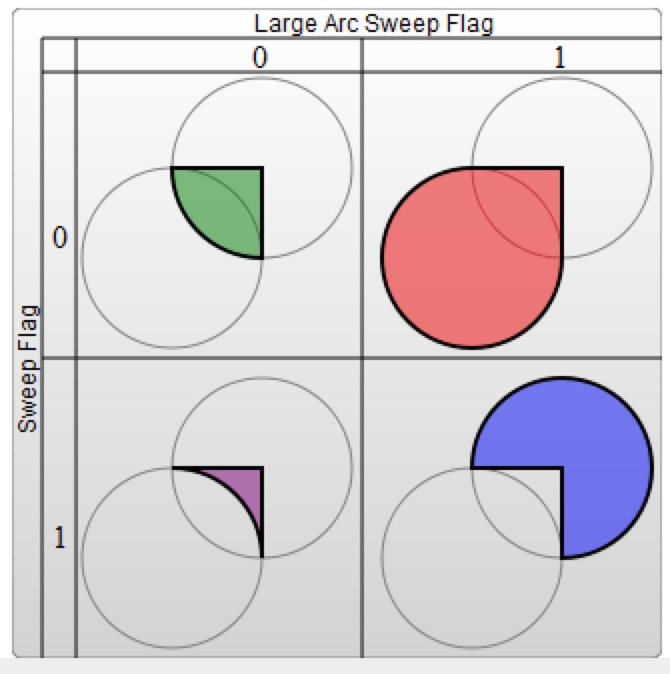

# SVG学习笔记
- 1.path元素的形状是由属性d来定义的，属性d的值是一个命令＋参数的序列，M＝move to L＝line to H＝绘制平行线，V＝绘制垂直线，Z＝闭合图形，
- 2.通过相对位置来绘制图形，命令使用的小写字母.相对坐标形式是相对于它前面的点需要移动的距离
- 3.C命令是三次贝塞尔曲线的命令，C 起点控制点，终点控制点，终点位置   S命令是简单的贝塞尔曲线，S 终点控制点，终点，如果S命令跟在C或者另外一个S命令后面，此时的另外一个控制点是跟另外一个控制点对称位置的
- 4.Q命令是二次贝塞尔曲线，只需要一个控制点  Q 控制点 终点； T命令是简化版的Q命令，T命令前边必须是一个Q命令或者T命令，如果T单独使用，控制点就会被认为和终点是一个点，画出来会是一条直线
- 5.A命令是弧线命令，共有七个参数：水平方向半径，竖直方向半径，旋转的角度，large-arc-sweep弧线大于180度（1）或者小于180度（0），sweep-flag起点到终点顺时针（1）还是逆时针（0），指定弧线的终点

    <!-- ({:height="200px" width="200px"}) -->
    
- 6.fill属性设置对象内部的颜色，stroke设置绘制对象线条的颜色。
- 7.storke-linecap 是线条描边的样式，stroke-linejoin是线条连接出的样式，stroke-dasharray是指的虚线的样式，是由一组逗号分隔的数字组成的数列，而且必须有逗号作为分割，第一个数字表示填色区域的长度，第二个数字表示间隔区域的长度，一组数字要循环出一个偶数模式，再以偶数模式进行循环
- 8.css可以利用style属性插入元素行间样式，或者使用style标签在defs标签中加入一些不会在svg图形中出现但是可以被其他元素使用的元素。

    ```
    <?xml version="1.0" standalone="no"?>
    <svg width="200" height="200" xmlns="http://www.w3.org/2000/svg" version="1.1">
      <defs>
        <style type="text/css"><![CDATA[
           #MyRect {
             stroke: black;
             fill: red;
           }
        ]]></style>
      </defs>
      <rect x="10" height="180" y="10" width="180" id="MyRect"/>
    </svg>

    ```
    ```
    <?xml version="1.0" standalone="no"?>
    <?xml-stylesheet type="text/css" href="style.css"?>

    <svg width="200" height="150" xmlns="http://www.w3.org/2000/svg" version="1.1">
    <rect height="10" width="10" id="MyRect"/>
    </svg>
    ```
- 9.渐变分为线性渐变和径向渐变，必须给渐变内容指定一个id，然后其他的元素必须通过这个id去引用它。渐变内容需要定义在defs标签内，而不是定义在形状上。
- 10.在<linearGradient>和<radialGradient>内部会定义stop元素节点，表示渐变上的颜色坡度，这些节点通过设置指定位置的offset和stop－color属性来说明渐变的特定位置应该是什么颜色
- 11.xlmns是svg的命名空间
- 12.径向渐变（radialGradient）通过两个点确定其边缘位置，第一个点定义渐变围绕的圆环的中心，有cx和cy以及r确定，第二个点为焦点，由fx和fy定义，表示渐变的中心位置。
- 13.spreadMethod用于描述渐变的过程，有pad、reflect和repeat三个属性值
- 14.pattern图案需要放在defs标签内，在pattern中可以包含任何其他的形状，这些形状可以用之前任何的样式处理。